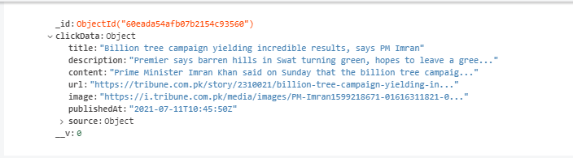
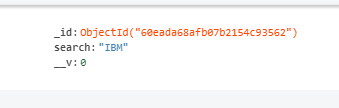

## Development server

To set up the project: 
 
Navigate to main directory `article-search` and run `npm install` to install dependencies for the frontend.
 
Navigate to `article-search/be` and run `npm install` to install dependencies for the backend.

To start the server:
 
Navigate to `article-search/be` and run `nodemon ./index.js` to start the backend server.
 
Navigate to `article-search` and run `ng serve` to start the frontend dev server server.

In your browser navigate to `http://localhost:4200/`.

Interacting with the frontend app will create logs in mongoDB with a default path of `mongodb://localhost:27017/article-search-be`:
1. Clicks on a article - sends article object to `article-search-be.clickmodels`
 

2. Search input - sends a string to `article-search-be.searchmodels`
 

## Frontend app preview:

